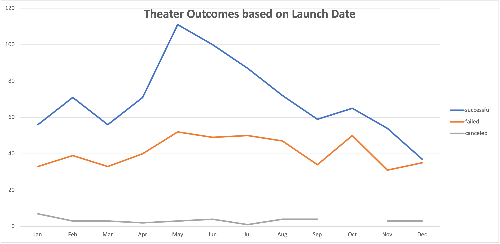
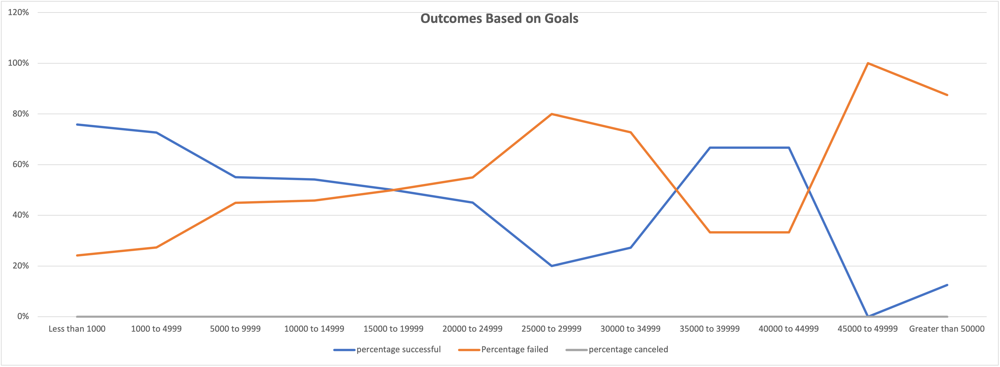

# Kickstarter-analysis
performing analysis on kickstarter data to find trends
# Kickstarting with Excel

## Overview of Project:

  The goal of this analysis was to draw conclusions and further visualize the data on the dataset, \"Kickstarter.xlsx"\.

In this challenge, I was trying to help Louise better visualize and understand how other campaigns did based on their launch dates and fundraising goals.  The purpose of this challenge was to collect and organize data in various ways in order to make unreadable data, readable, to our client Louise.  From the data, we were able to draw various conclusions. 

## Analysis and Challenges

  * I was able to preform my analysis by creating two sheets in \"Kickstarter_Challenge"\, named \"Outcomes Based on Launch Date"\, and \"Outcomes Based on Goals"\.  
      - The first analysis was made using a pivot table to help visualize the number of successful, failed and canceled theater campaigns in regard to their launch month and could be filtered by year as well as by parent category in order to see different types of campaigns and not just theater.
      - The second analysis visualized the Outcomes based on a range of Goals of various campaigns and data points from the dataset \"kickstarter"\, as well as graphing the data based on the percentage of success, failure and cancelation.
      ### Data Visualizations
      1) 
      2) 
	
	### Challenges
During this module I did encounter a few issues, however for the most part the issues were with my computer and not with the actual applications of the module. 
	1) bash error:  file or directory does not exist:
		* this was the main error that I ran into when I was trying to use git commit to commit my files to my project repository.  The folder that I created on my desktop named, \"Analytics_projects' was not reachable using my \"cd" command.  I tried using \"pwd" to see which directory I was in and then used \"ls" while in the desktop directory to see if the folder would show up.  The file was shown under Desktop, but for some reason was still unreachable to be used with \"git commit". 

	### Solution:
I created a new directory using \"mkdir" and then transferred my files from \"Analytics_projects" into the new directory.  Once I did this, I was able to access the correct directory and was able to copy my repository into it.  From there I used my text editor to edit my README file and make changes to my files and then add, commit, and push my changes to my GitHub repository.
      
### Analysis of Outcomes Based on Launch Date

### Analysis of Outcomes Based on Goals

### Challenges and Difficulties Encountered

## Results

- What are two conclusions you can draw about the Outcomes based on Launch Date?

- What can you conclude about the Outcomes based on Goals?

- What are some limitations of this dataset?

- What are some other possible tables and/or graphs that we could create?
